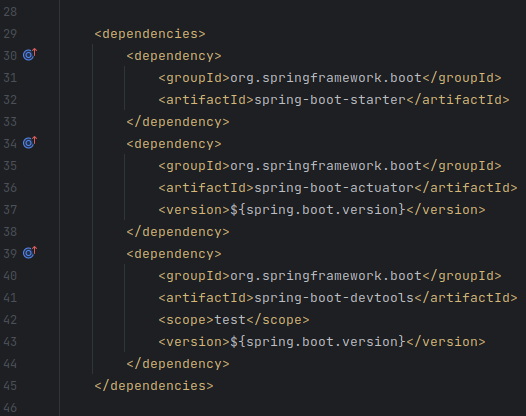
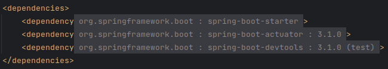

# mavenDependencyCollapse

<!-- Plugin description -->
This plugin collapses maven dependencies for cleaner files.

From

To

The plugin uses the built-in folding regions from the IDE, so even though they are collapsed by default you can just click on them, use the shortcuts or the sidebar arrows to fold/unfold. Additionally, a 'collapse all dependencies' action is available from the right-click menu (on the file).

The format of the collapsible text is: ` groupId : artifactId : version (scope)` with version and scope being optional. May consider allowing for custom formats if the plugin is popular enough.

<!-- Plugin description end -->

## Installation

- Using IDE built-in plugin system:
  
  <kbd>Settings/Preferences</kbd> > <kbd>Plugins</kbd> > <kbd>Marketplace</kbd> > <kbd>Search for "Maven Dependency Collapse"</kbd> >
  <kbd>Install Plugin</kbd>
  
- Manually:

  Download the [latest release](https://github.com/TrianguloY/mavenDependencyCollapse/releases/latest) and install it manually using
  <kbd>Settings/Preferences</kbd> > <kbd>Plugins</kbd> > <kbd>⚙️</kbd> > <kbd>Install plugin from disk...</kbd>

## Template ToDo list
- [x] Create a new [IntelliJ Platform Plugin Template][template] project.
- [ ] Get familiar with the [template documentation][template].
- [x] Adjust the [pluginGroup](./gradle.properties), [plugin ID](./src/main/resources/META-INF/plugin.xml) and [sources package](./src/main/kotlin).
- [x] Adjust the plugin description in `README` (see [Tips][docs:plugin-description])
- [x] Review the [Legal Agreements](https://plugins.jetbrains.com/docs/marketplace/legal-agreements.html?from=IJPluginTemplate).
- [ ] [Publish a plugin manually](https://plugins.jetbrains.com/docs/intellij/publishing-plugin.html?from=IJPluginTemplate) for the first time.
- [x] Set the `PLUGIN_ID` in the above README badges.
- [ ] Set the [Plugin Signing](https://plugins.jetbrains.com/docs/intellij/plugin-signing.html?from=IJPluginTemplate) related [secrets](https://github.com/JetBrains/intellij-platform-plugin-template#environment-variables).
- [ ] Set the [Deployment Token](https://plugins.jetbrains.com/docs/marketplace/plugin-upload.html?from=IJPluginTemplate).
- [ ] Click the <kbd>Watch</kbd> button on the top of the [IntelliJ Platform Plugin Template][template] to be notified about releases containing new features and fixes.

This Fancy IntelliJ Platform Plugin is going to be your implementation of the brilliant ideas that you have.

This specific section is a source for the [plugin.xml](/src/main/resources/META-INF/plugin.xml) file which will be extracted by the [Gradle](/build.gradle.kts) during the build process.

To keep everything working, do not remove `<!-- ... -->` sections.

---
Plugin based on the [IntelliJ Platform Plugin Template][template].

[template]: https://github.com/JetBrains/intellij-platform-plugin-template
[docs:plugin-description]: https://plugins.jetbrains.com/docs/intellij/plugin-user-experience.html#plugin-description-and-presentation