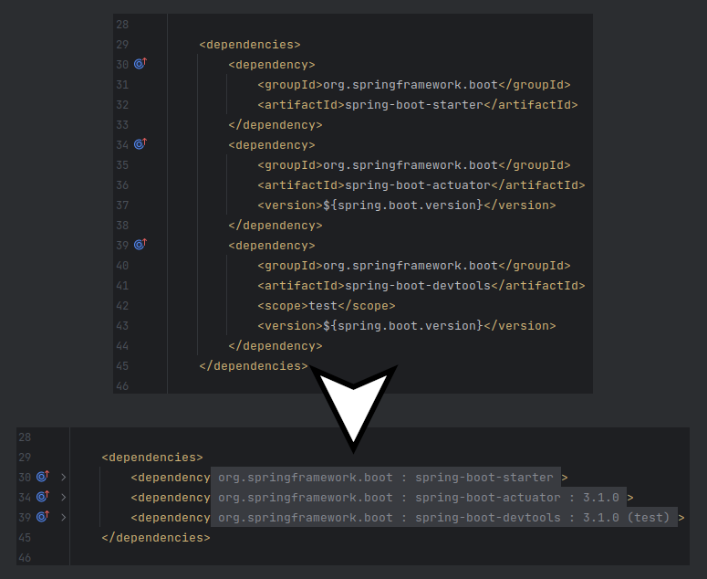

<h1>Maven Dependency Collapse plugin</h1>

<!-- Plugin description -->
**This plugin collapses maven dependencies for cleaner files.**

The plugin uses the built-in folding regions from the IDE, so you can just click on them, use the native shortcuts, or click the sidebar arrows to fold/unfold. Additionally, a 'collapse all dependencies' action is available from the editor right-click menu (if there are available regions).

The format of the collapsible text by default is: ` [scope] groupId : artifactId : version ` with version and scope being optional.

From the plugin settings (File | Settings | Tools | [Maven Dependency Collapse](jetbrains://Idea/settings?name=Tools--Maven+Dependency+Collapse)) you can configure:
- Whether dependencies are collapsed by default (default true).
- The collapsible text (see above for default).

---

Note: the plugin was developed for personal use, but published so friends and workmates can benefit from it. If you want to suggest or (even better) improve it yourself, the whole source code is available on [GitHub](https://github.com/TrianguloY/mavenDependencyCollapse). Any issue/pr will be welcomed!
<!-- Plugin description end -->

## Installation

- Using IDE built-in plugin system:
  
  <kbd>Settings/Preferences</kbd> > <kbd>Plugins</kbd> > <kbd>Marketplace</kbd> > <kbd>Search for "Maven Dependency Collapse"</kbd> >
  <kbd>Install Plugin</kbd>

- From the browser:

  Open the [plugin marketplace page](https://plugins.jetbrains.com/plugin/22423-maven-dependency-collapse) and press on 'Install'.

  
- Manually:

  Download the [latest release](https://github.com/TrianguloY/mavenDependencyCollapse/releases/latest) and install it manually using
  <kbd>Settings/Preferences</kbd> > <kbd>Plugins</kbd> > <kbd>⚙️</kbd> > <kbd>Install plugin from disk...</kbd>

---
Plugin based on the [IntelliJ Platform Plugin Template](https://github.com/JetBrains/intellij-platform-plugin-template).
